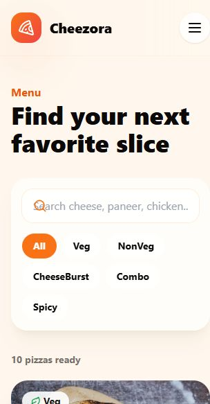

# Premium Pizza Restaurant App

Full-stack online pizza restaurant application built from `agent.md`.

## Screenshot



## Stack

- Frontend: React, Vite, Tailwind CSS, Framer Motion, React Router, Axios, Lucide
- Backend: Java 17, Spring Boot, Spring Security, JWT, Spring Data JPA, H2

## Run Backend

```bash
cd backend
mvn spring-boot:run
```

Backend: `http://localhost:8080`

H2 console: `http://localhost:8080/h2-console`

- JDBC URL: `jdbc:h2:mem:pizzadb`
- Username: `sa`
- Password: blank

## Run Frontend

```bash
cd frontend
npm install
npm run dev
```

Frontend: `http://localhost:5173`

## Seeded Accounts

- Admin: `admin@pizza.com` / `admin123`
- User: `user@pizza.com` / `user123`

## Features

- JWT register/login with user and admin roles
- Pizza menu with search, category filters, ratings and cart
- LocalStorage cart and theme persistence
- Checkout with COD and dummy UPI UI
- Order success and my orders pages
- Admin dashboard, pizza CRUD and all-orders view
- H2 in-memory seed data with 10 pizzas
